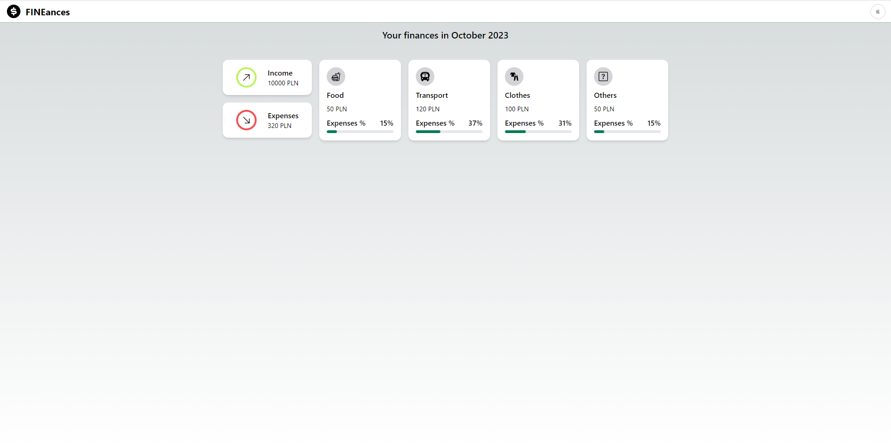
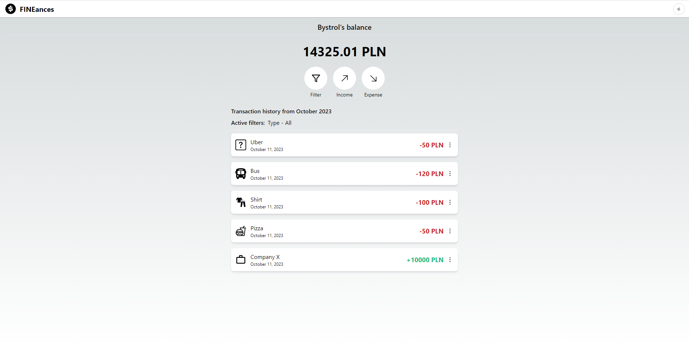

# FINEances - finance manager
> This app allows you to be in control of your finances. You can add income, expenses, filter them and group them according to categories.
> Live demo [_here_](https://finance-manager-six.vercel.app/).

## Table of Contents
* [General Info](#general-information)
* [Technologies Used](#technologies-used)
* [Features](#features)
* [Screenshots](#screenshots)
* [Setup](#setup)
* [Usage](#usage)
* [Project Status](#project-status)
* [Room for Improvement](#room-for-improvement)
* [Acknowledgements](#acknowledgements)
* [Contact](#contact)

## General Information
I took on this project because I needed an app to control my finances. I wanted to be able to group expenses into categories and compare them by month or year. In the process, I wanted to learn new technologies such as Next.js, TypeScript, Tailwind and Next-Auth for user authentication.

## Technologies Used
- Next.js - version 13.4.1
- TypeScript - version 5.0.4
- TailwindCSS - version 3.3.2
- Next-Auth - version 4.22.1
- Redux Toolkit - version 1.9.5
- Prisma - version 5.0
- MongoDB

## Features
- User authentication with credentials/Google OAuth/Github OAuth
- Inline validation of credentials
- Updating user's profile information
- Adding, editing, deleting income and expenses with connection to a database (CRUD)
- Filtering transactions by month, year, type, category
- Grouping expenses into categories and displaying percentage of the total amount of expenses

## Screenshots

## Setup
To get started with the project, follow the steps below:
- Clone the repository onto your device
- Open the repository in some code editor, for example VSCode and type 'npm install' in the terminal
- Add .env file with the following variables: 'DATABASE_URL', 'NEXTAUTH_JWT_SECRET', 'NEXTAUTH_SECRET', 'GITHUB_ID', 'GITHUB_SECRET', 'GOOGLE_ID', 'GOOGLE_SECRET' and fill them with your data
- Type 'npm run dev' to run the app on your localhost

## Project Status
Project is: _in progress_.

## To do
- Drawing charts and comparing them by year, month
- Setting a financial target
- AI giving hints on the budget

## Contact
Created by [@bystrol](https://github.com/Bystrol) - all rights reserved.